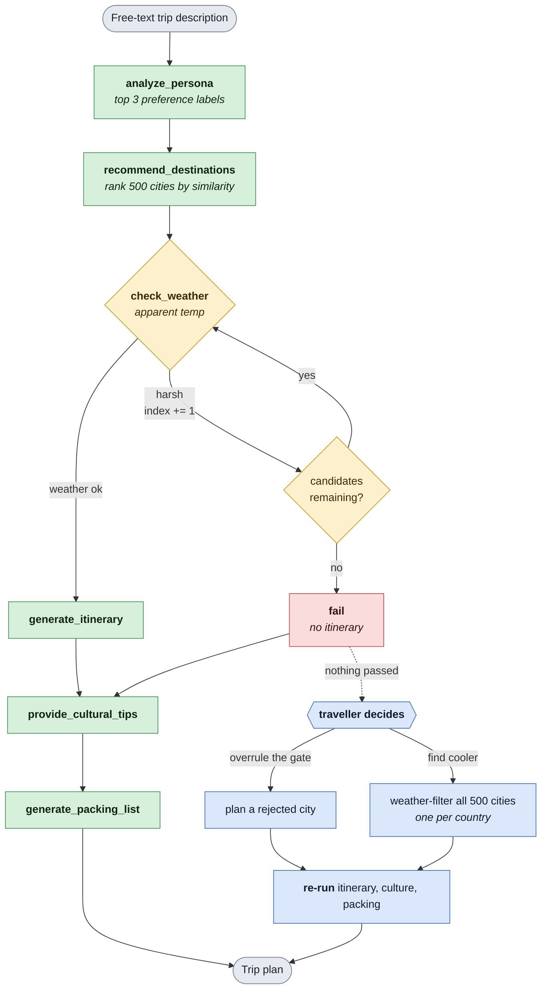

# Multi-Agent Travel Planner

A multi-agent travel planning system that starts from **who you are**, not from a city you
already picked. Describe the trip you want in plain language and six specialised agents infer
your travel persona, rank 500 world cities against it, check live weather at each candidate,
and build a complete plan — itinerary, cultural notes and packing list — for the destination
that actually fits.

**Live demo:** https://travel-planner.gentlemushroom-48179c71.centralus.azurecontainerapps.io

_Hosted on Azure Container Apps with scale-to-zero, so the first request after an idle period
takes roughly 30 seconds to wake up._

## Table of Contents

- [Overview](#overview)
- [Interface](#interface)
- [Features](#features)
- [Architecture](#architecture)
- [The Agents](#the-agents)
- [Tech Stack](#tech-stack)
- [Why This Stack](#why-this-stack)
- [Tradeoffs](#tradeoffs)
- [Project Structure](#project-structure)
- [Data](#data)
- [Getting Started](#getting-started)
- [Deployment](#deployment)
- [What I'd Do Differently at Scale](#what-id-do-differently-at-scale)

## Overview

Maybe you know the kind of trip you want — beaches, food, nature, nightlife, history,
something relaxing, something adventurous — but not where to go. Most planners ask you to
choose a destination first. This one discovers it.

Your preferences become the input. Your persona becomes the search signal. The destination
falls out of the ranking.

The agents are wired as a LangGraph `StateGraph` with a real branch in it: the weather check
is a gate that walks down the ranked shortlist, rejecting cities and advancing a cursor until
one passes or the list runs out. When nothing passes, the app does not dead-end — it hands
the decision back to you.

## Interface

Describe the trip you want in plain language and hit **Let's Plan**. The left rail streams the
current step and an activity log as each agent runs, while the right panel renders the agent
graph live.


## Features

- **Persona inference from free text** — zero-shot classification across 12 travel labels, no
  form-filling and no training data required
- **Semantic destination ranking** — persona and city descriptions embedded and compared by
  cosine similarity across 500 cities
- **Live weather gating** — real apparent temperature from Open-Meteo at request time, never
  from stored data, with automatic fallthrough to the next candidate
- **Human in the loop** — when every candidate is rejected, overrule the gate or search the
  whole catalogue for cities that pass
- **Whole-catalogue weather filtering** — all 500 cities checked in 5 batched requests
  (~1.6s), so the search is not limited to a narrow window
- **Country diversity cap** — at most one city per country in the shortlist
- **Live agent graph** — the LangGraph topology rendered in the UI alongside a streaming
  activity log
- **Single Mistral client** — all three generative agents share one entry point, so the model
  and endpoint are defined in exactly one place
- **Containerised with baked-in weights** — no model download on cold start
- **Deployed on Azure Container Apps** — scale-to-zero, secret-injected credentials

## Architecture

### System Overview

```
User (Browser)
      |
      |  HTTP / WebSocket
      v
Streamlit UI  (port 8501)
      |
      +--> Live agent graph (NetworkX + Plotly)
      +--> Streaming activity log (queue)
      +--> Human-in-the-loop controls (session_state)
      |
      v
LangGraph StateGraph  (TripState)
      |
      +--> analyze_persona ........ DeBERTa-v3 zero-shot  (local)
      +--> recommend_destinations . MiniLM embeddings     (local, cached)
      +--> check_weather .......... Open-Meteo API        (1h cache, retries)
      +--> generate_itinerary ..|
      +--> provide_cultural_tips.|-> utils/mistral.py --> HF router
      +--> generate_packing_list.|                        Mistral-7B-Instruct-v0.2
```

### Agent Flow

The blue steps are not graph nodes. The `StateGraph` always runs to completion; when it ends
in `fail` the app offers those choices and re-runs the three generative agents for whichever
city you pick. Shared state is a `TripState` TypedDict carrying the persona, ranked
recommendations, a cursor into that list, the weather verdict and each agent's output.

The app renders this same graph live while the plan is being built:


### Human in the Loop

The weather gate only accepts `chilly` and `warm`, i.e. **15–28 °C**, so a summer query can
easily have every candidate skipped. Rather than dead-end, the app offers two routes:

- **Plan one of these anyway** — overrule the gate and build the trip for a rejected city
- **Find cooler alternatives** — weather-filter the entire catalogue and rank the cities that
  do pass, capped at one per country

Either route re-runs the itinerary, culture and packing agents for the chosen city and labels
which route produced the result, so the automated verdict stays visible and overridable rather
than final.

## The Agents

| Agent | Does | Model |
|---|---|---|
| **Persona** | Classifies free text across 12 labels (`beach`, `history`, `food`, `budget`, `luxury`, `nature`, `nightlife`, …), keeps the top 3 | DeBERTa-v3 zero-shot, local |
| **Destination** | Embeds persona and city features, ranks 500 cities by cosine similarity | MiniLM-L6-v2, local |
| **Weather** | Fetches apparent temperature, buckets it `freezing`→`very hot`, accepts only `chilly`/`warm` | Open-Meteo API |
| **Itinerary** | Day-by-day plan for the selected destination | Mistral-7B-Instruct |
| **Culture** | Local customs, food and etiquette notes | Mistral-7B-Instruct |
| **Packing** | Categorised packing list tailored to destination and persona | Mistral-7B-Instruct |

## Tech Stack

| Layer | Technology | Purpose |
|---|---|---|
| Frontend | Streamlit, Plotly, NetworkX | UI, live graph rendering, streaming logs |
| Orchestration | LangGraph (`StateGraph`) | Stateful routing with a conditional retry loop |
| Persona classification | `MoritzLaurer/DeBERTa-v3-base-mnli-fever-anli` | Zero-shot labelling, no training data |
| Destination matching | `sentence-transformers/all-MiniLM-L6-v2` | Local embeddings, cosine similarity |
| Text generation | `mistralai/Mistral-7B-Instruct-v0.2` via HF router | Itinerary, culture, packing |
| Weather | [Open-Meteo](https://open-meteo.com/) | Live apparent temperature, batched, 1h cache |
| Container | Docker (python:3.12-slim) | Weights baked in, CPU-only torch |
| Hosting | Azure Container Apps | Serverless containers, scale-to-zero |
| Registry | Azure Container Registry | Image storage |

## Why This Stack

**LangGraph over a plain function chain.** The weather check is not a linear step — it is a
gate with three outcomes that loops back onto itself while advancing a cursor. LangGraph makes
that a first-class conditional edge with typed state, so each node stays a testable function
and the topology can be rendered directly in the UI. A hand-rolled loop would work but would
not be inspectable.

**Zero-shot classification over an LLM call for persona.** DeBERTa-v3 fine-tuned on MNLI
labels free text against a fixed taxonomy with no training data, no prompt engineering and no
per-query API cost. Asking an LLM to pick labels would work, but adds latency and a network
dependency to a step that is really just constrained classification.

**Local embeddings over an embeddings API.** MiniLM-L6-v2 runs on CPU with no key, no rate
limit and no per-call cost. The 500 city vectors are computed once and cached in-process, so
repeat queries skip encoding entirely — measured at **5.7s cold, 1.0s warm**.

**Remote Mistral over a local 7B.** Running Mistral-7B locally would mean ~15 GB of weights
and slow CPU inference. Routing generation to hosted inference keeps the image around 1 GB and
the container within a 2 GB memory budget, while the two small models that benefit from being
local stay local.

**Open-Meteo over a commercial weather API.** Free, no key, and — critically — it accepts many
coordinates in a single request. That property is what makes whole-catalogue filtering viable:
500 cities in **5 requests, ~1.6s**, versus 25 cities in 25 sequential calls at ~10.6s.

**Streamlit over a separate JS frontend.** One language end to end, and the streaming activity
log and live graph are a few lines rather than a WebSocket layer plus a component library. The
tradeoff is documented below.

**Azure Container Apps over the other free tiers.** The app holds **1.21 GiB** resident with
both models loaded and peaks at **1.31 GiB** through a plan. That measurement ruled out Render
free (512 MB), Azure App Service F1 (1 GB) and AWS `t3.micro` (1 GB). Container Apps allows a
2 GB allocation, scales to zero, and its free grant renews monthly rather than expiring after
12 months.

## Tradeoffs

**The city dataset barely discriminates.** The 500 cities share only **12 distinct feature
strings** — 241 cities share one, 189 share another. So 86% of the catalogue collapses into
two descriptions, similarity scores tie constantly, and "best match" is often resolved by file
order rather than by meaning. The per-country cap keeps the shortlist looking varied, but it
masks the problem rather than fixing it. Enriching per-city descriptions is the highest-value
improvement available.

**The weather gate is strict.** Only `chilly` and `warm` pass, so anything outside 15–28 °C is
rejected. In summer that fails most interesting destinations — three Mediterranean cities in
September were all rejected at 30–32 °C. Human-in-the-loop exists precisely because of this;
widening the band is a product decision, not a bug fix.

**No reranking.** Retrieval is pure cosine similarity with no cross-encoder pass. Given how
little the feature strings vary, reranking would help less here than fixing the data.

**Models load in-process.** Persona and embedding models live in the app's memory, which sets
the 2 GB floor and rules out the smallest hosting tiers. Moving both to remote inference would
drop `torch`, `transformers` and `sentence-transformers` entirely and shrink the image
dramatically.

**Session state is per-instance.** Results live in `st.session_state`, so they are per-browser
-session and lost on restart. With `max-replicas 2` there is no shared store, so a user pinned
to a different replica would not see their earlier result.

**No authentication.** The deployed URL is public. Anyone with the link can run plans against
the configured Hugging Face token.

**Cold start.** Scale-to-zero costs the first visitor after an idle period roughly 30 seconds.
Keeping one replica warm removes it but consumes the monthly grant in a few days.

**Generation quality is unevaluated.** There is no golden set and no faithfulness scoring; the
itinerary and culture outputs are judged by reading them.

## Project Structure

```
Multi-Agent-Travel-Discovery-Planner/
├── travel_planner/
│   ├── app.py                    # Streamlit UI, live graph, human-in-the-loop
│   ├── agents/
│   │   ├── persona_agent.py      # Zero-shot persona classification
│   │   ├── destination_agent.py  # Embedding rank, cached city vectors
│   │   ├── weather_agent.py      # Standalone weather check
│   │   ├── itinerary_agent.py    # Day-by-day plan
│   │   ├── culture_agent.py      # Local customs and etiquette
│   │   └── packing_agent.py      # Categorised packing list
│   ├── langgraph_setup/
│   │   ├── trip_flow_graph.py    # Graph wiring + weather routing
│   │   ├── nodes.py              # Node wrappers, HARSH_CONDITIONS
│   │   ├── state.py              # TripState schema
│   │   └── run_graph.py          # Streams the graph to completion
│   ├── langchain_agents/         # Alternate LangChain ReAct agent
│   ├── utils/
│   │   ├── mistral.py            # Single entry point for text generation
│   │   ├── weather_api.py        # Open-Meteo, single + batched lookup
│   │   └── weather_utils.py      # Temperature bucketing
│   └── data/                     # City datasets
├── docs/images/                  # Screenshots used in this README
├── Dockerfile
├── requirements.txt
└── .env.example
```

## Data

`data/top_500_cities.json` holds the 500 cities the planner ranks, each with coordinates and a
feature description used for matching:

```json
{ "city": "Tokyo", "lat": 35.6897, "lng": 139.6922,
  "country": "Japan",
  "features": "Sense of History, Architectural Awe, Spiritual or Reflective Mood" }
```

Temperature is **not** stored here. Coordinates come from this file; the apparent temperature
is fetched live from Open-Meteo at request time, which is why the same query can resolve to a
different city on a different day.

## Getting Started

### Prerequisites

- Python 3.12
- A [Hugging Face token](https://huggingface.co/settings/tokens) (free)
- Docker, if you want to run the container rather than the source

### Local Development

**1. Clone and create a virtual environment**
```bash
git clone https://github.com/madhumitha-gv/Multi-Agent-Travel-Discovery-Planner.git
cd Multi-Agent-Travel-Discovery-Planner
python -m venv venv
```

**2. Activate it**

macOS / Linux:
```bash
source venv/bin/activate
```
Windows:
```bash
venv\Scripts\activate
```

**3. Install dependencies**
```bash
pip install -r requirements.txt
```

**4. Set up environment variables**
```bash
cp .env.example .env
```
Open `.env` and add your Hugging Face token. `.env` is gitignored — never commit it.

**5. Run the app**

The modules import each other by top-level name, so run from inside `travel_planner/`:
```bash
cd travel_planner
streamlit run app.py
```

Open http://localhost:8501.

> **Note:** the first run downloads the DeBERTa and MiniLM models — a few minutes and a couple
> of GB of disk. Text generation runs remotely, so no 7B weights are downloaded.

### Optional: the LangChain ReAct agent

`langchain_agents/agent_controller.py` is a separate conversational variant exposing the same
tools through a LangChain ReAct agent. It uses `gpt-3.5-turbo`, so it needs an `OPENAI_API_KEY`
in `.env` as well:
```bash
cd travel_planner
python -m langchain_agents.agent_controller
```

## Deployment

The app runs on **Azure Container Apps** in Central US as a container built from the
`Dockerfile` in this repo.

### Design notes

- **Weights are baked into the image.** The Dockerfile downloads DeBERTa and MiniLM at build
  time, so a cold start pays no download and needs no writable model cache.
- **CPU-only torch on Linux.** The default PyPI wheel pulls 14 nvidia/triton packages
  (~2.5 GB) that a CPU host never uses; the CPU wheel is 170 MB. `requirements.txt` pins this
  conditionally so macOS installs still resolve normally.
- **Sizing is 1 vCPU / 2 GB**, against a measured 1.31 GB peak.
- **`--min-replicas 0`** so it costs nothing while idle, at the price of a ~30s cold start.
- **The token is a Container Apps secret** injected as an environment variable, never baked
  into the image, so it can be rotated without a rebuild.

### Run the container locally
```bash
docker build -t travel-planner .
docker run -p 8501:8501 -e HUGGINGFACEHUB_API_TOKEN=your_token travel-planner
```

### Deploy from scratch

**1. Prerequisites**
- An Azure subscription (Azure for Students works and needs no credit card)
- Azure CLI: `brew install azure-cli`
- Docker

**2. Sign in and register providers**
```bash
az login
az provider register -n Microsoft.App
az provider register -n Microsoft.OperationalInsights
az provider register -n Microsoft.ContainerRegistry
```

**3. Create the resource group and registry**
```bash
az group create -n travel-planner-rg -l centralus
az acr create -n <registry-name> -g travel-planner-rg --sku Basic --admin-enabled true
```

**4. Build and push the image**

Container Apps runs on amd64, so build for that platform explicitly on an ARM machine such as
an Apple Silicon Mac:
```bash
az acr login -n <registry-name>
docker buildx build --platform linux/amd64 \
  -t <registry-name>.azurecr.io/travel-planner:v1 --load .
docker push <registry-name>.azurecr.io/travel-planner:v1
```

**5. Create the environment and deploy**
```bash
az containerapp env create -n travel-planner-env -g travel-planner-rg -l centralus

az containerapp create \
  -n travel-planner -g travel-planner-rg \
  --environment travel-planner-env \
  --image <registry-name>.azurecr.io/travel-planner:v1 \
  --registry-server <registry-name>.azurecr.io \
  --target-port 8501 --ingress external \
  --cpu 1.0 --memory 2.0Gi \
  --min-replicas 0 --max-replicas 2 \
  --secrets hf-token=<your-token> \
  --env-vars HUGGINGFACEHUB_API_TOKEN=secretref:hf-token PORT=8501
```

The command prints the public HTTPS URL on success.

### Redeploy after a change
```bash
docker buildx build --platform linux/amd64 \
  -t <registry-name>.azurecr.io/travel-planner:v2 --load .
docker push <registry-name>.azurecr.io/travel-planner:v2
az containerapp update -n travel-planner -g travel-planner-rg \
  --image <registry-name>.azurecr.io/travel-planner:v2
```

### Gotchas

- **Azure for Students restricts regions.** `eastus`, `eastus2` and `westus2` were all
  rejected with `RequestDisallowedByAzure`; `centralus` worked.
- **A fresh subscription may need a tenant-scoped login.** If every call returns
  `AuthorizationFailed` even for reads, re-authenticate against the tenant directly:
  `az login --tenant <tenant-id>`.
- **The deployed app is public with no authentication.** Anyone with the link can run plans
  against the configured token. Container Apps has built-in auth if that needs locking down.

## What I'd Do Differently at Scale

**Enrich the city descriptions.** This is the single highest-value fix. With only 12 distinct
feature strings across 500 cities, the ranking cannot meaningfully separate most of the
catalogue. Per-city descriptions — generated from travel content, or derived from structured
attributes — would make the similarity score mean something and make the country cap
unnecessary.

**Move the local models to remote inference.** Persona classification and embeddings are the
only reason `torch`, `transformers` and `sentence-transformers` are dependencies. Moving both
to hosted inference would cut the image from ~1 GB to tens of MB, drop the memory floor below
256 MB, and make the app deployable on essentially any free tier.

**Add a reranking pass.** A cross-encoder between retrieval and selection would improve
ordering for nuanced queries — worth doing after the data problem is fixed, not before.

**Shared session and cache state.** Replace `st.session_state` and the per-instance
`requests-cache` file with Redis, so results and weather lookups survive restarts and are
shared across replicas.

**Authentication.** API key or OAuth in front of the app before sharing it widely, so
inference quota is not open to anyone with the URL.

**An evaluation harness.** A golden set of persona→destination pairs to catch ranking
regressions, plus faithfulness scoring on generated itineraries.

**Observability.** LangSmith or LangFuse tracing to see per-node latency and token usage,
which currently have to be inferred from logs.

**CI/CD.** A GitHub Actions workflow to test, build the amd64 image, push to ACR and deploy on
merge to `main`, replacing the manual build-and-push loop.
