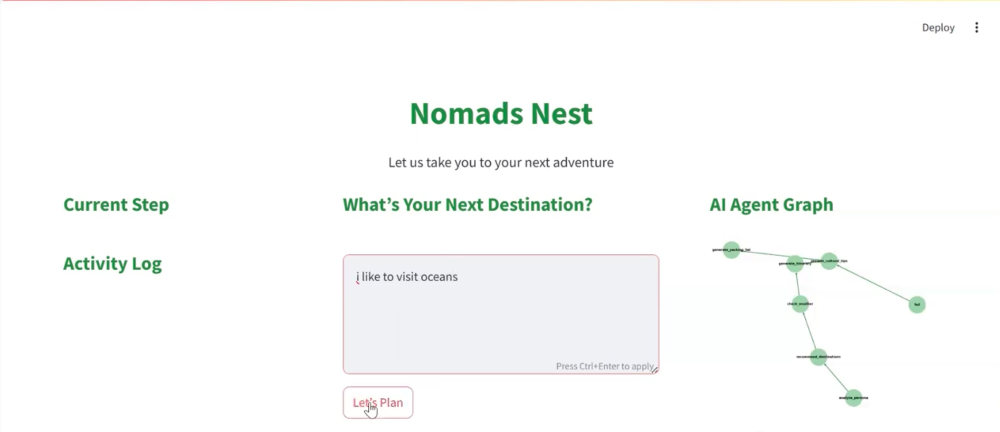
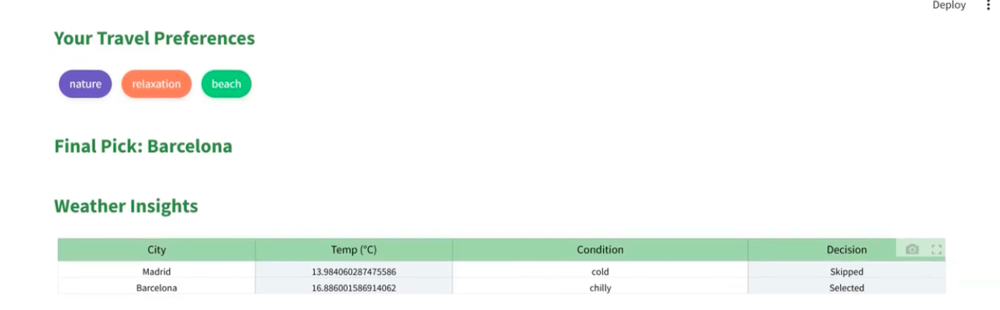
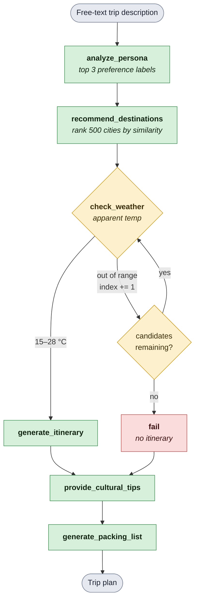
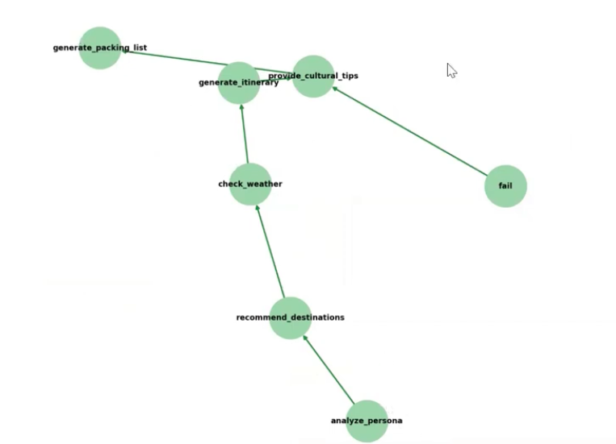

# Multi-Agent Travel Planner

Are you a travel enthusiast who wants to explore somewhere new but has no idea where to go?

Maybe you know the kind of trip you want — beaches, food, nature, nightlife, history, something relaxing, something adventurous — but not the destination.

That is exactly what this project is built for.

The **Multi-Agent Travel Planner** takes a simple free-text description of your ideal trip, understands your travel persona, matches it against 500 cities, checks live weather for the best candidates, and builds a complete travel plan around the destination that fits you best. 

Instead of asking you to choose a city first, the planner starts with **you**.

Your preferences become the input.

Your persona becomes the search signal.

And the destination is discovered from there.

## The Interface

Describe the trip you want in plain language and hit **Let's Plan**. The left rail streams the current step and an activity log as each agent runs, while the right panel renders the agent graph live.







## What It Does

You type something like *"a relaxed beach trip with good food, nothing too expensive"* and the system:

1. Infers your travel persona from that sentence
2. Ranks 500 cities by how well they match it
3. Checks the current apparent temperature at the top candidates and **skips any outside 15–28 °C**
4. Builds a day-by-day itinerary for the first city that passes
5. Adds local cultural tips and a personalized packing list

If every candidate has harsh weather, the graph routes to a failure branch and tells you to try different preferences rather than returning a bad plan.

## Tech Stack

| Layer | Technology |
|---|---|
| Frontend | Streamlit, Plotly, NetworkX, Matplotlib |
| Orchestration | LangGraph (`StateGraph`) |
| Persona classification | `MoritzLaurer/DeBERTa-v3-base-mnli-fever-anli` (zero-shot) |
| Destination matching | `sentence-transformers/all-MiniLM-L6-v2` (cosine similarity) |
| Itinerary & packing | `mistralai/Mistral-7B-Instruct-v0.3` via HF Inference API |
| Cultural tips | `EleutherAI/gpt-neo-1.3B` (local pipeline) |
| Weather | [Open-Meteo](https://open-meteo.com/) API, cached 1h with retries |

## The Agents

- **Persona Agent**  — Zero-shot classifies your input across 12 labels (`beach`, `adventure`, `history`, `food`, `budget`, `luxury`, `nature`, `nightlife`, …) and keeps the top 3.
- **Destination Agent**  — Embeds your persona and every city's feature string, then ranks all 500 cities by cosine similarity and returns the top 3.
- **Weather Agent**  — Fetches apparent temperature from Open-Meteo and buckets it (`freezing` / `cold` / `chilly` / `warm` / `hot` / `very hot`). Only `chilly` and `warm` pass, so a city is skipped unless it currently sits between **15 °C and 28 °C**; the graph then advances to the next candidate.
- **Itinerary Agent** — Generates a day-by-day plan for the selected destination.
- **Culture Agent**  — Provides local customs, food, and etiquette notes.
- **Packing Agent**  — Produces a packing list tailored to the destination and persona.

## How the Flow Works

The agents are wired as a LangGraph `StateGraph`. The interesting part is `check_weather`: it is a gate with three outcomes that walks down the ranked candidate list, advancing the cursor each time a city is rejected, until one passes or the list runs out.



The app renders this same graph live while the plan is being built:



Shared state is a `TripState` TypedDict passed between nodes, carrying the persona, the ranked recommendations, a cursor into that list, the weather verdict, and each agent's output.

## Project Structure

```
travel_planner/
├── app.py                    # Streamlit frontend
├── agents/                   # The six agents
│   ├── persona_agent.py
│   ├── destination_agent.py
│   ├── weather_agent.py
│   ├── itinerary_agent.py
│   ├── culture_agent.py
│   └── packing_agent.py
├── langgraph_setup/
│   ├── trip_flow_graph.py    # Graph wiring + weather routing
│   ├── nodes.py              # Node wrappers around the agents
│   ├── state.py              # TripState schema
│   └── run_graph.py          # Streams the graph to completion
├── langchain_agents/         # Alternate LangChain ReAct agent
├── utils/                    # Weather API + text helpers
└── data/                     # City datasets
```

## Data

`data/top_500_cities.json` holds the 500 cities the planner ranks, each with coordinates and a feature description used for matching:

```json
{ "city": "Tokyo", "lat": 35.6897, "lng": 139.6922,
  "country": "Japan",
  "features": "Sense of History, Architectural Awe, Spiritual or Reflective Mood" }
```

## How to Run the Project

### **1. Create a Virtual Environment**
```bash
python -m venv venv
```

### **2. Activate the Virtual Environment**
macOS / Linux:
```bash
source venv/bin/activate
```
Windows:
```bash
venv\Scripts\activate
```

### **3. Install Dependencies**
```bash
pip install -r requirements.txt
```

### **4. Set Up Environment Variables**
Copy `.env.example` to `.env` and add your [Hugging Face token](https://huggingface.co/settings/tokens):
```bash
cp .env.example .env
```
`.env` is gitignored — never commit your token.

### **5. Run the App**
The modules import each other by top-level name, so run from inside `travel_planner/`:
```bash
cd travel_planner
streamlit run app.py
```

> **Note:** the first run downloads the DeBERTa, MiniLM, and GPT-Neo models, so expect a few minutes and several GB of disk.

### **Optional: the LangChain ReAct agent**
`langchain_agents/agent_controller.py` is a separate conversational variant that exposes the same tools through a LangChain ReAct agent. It uses `gpt-3.5-turbo`, so it needs an `OPENAI_API_KEY` in your `.env` as well:
```bash
cd travel_planner
python -m langchain_agents.agent_controller
```
